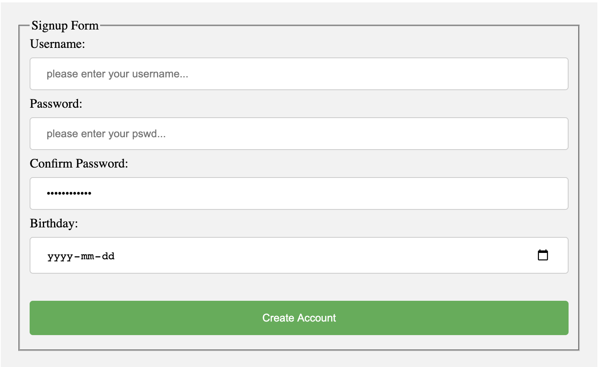

# Documentation <small>v1.0.0</small>
----

# Getting started

## install
```html
<script src="https://code.jquery.com/jquery-3.5.1.js" defer></script>
<script type="text/javascript" src="location/of/FormBuilder.js" defer></script>
```

## initialize

```javascript
const formBuilder = new FormBuilder();
```
----
----

# How it works? 

- [skip](#api) this section if you don't care/only want to use built-in forms


<div align="center">the following explanations are based on the above form</div>

## Object explaination

All information about a particular form is stored in a `style` object. Note: users do not need to write this form entirely from scratch, there’re some built-in `style` objects and some helpers made for creating this Object.

All of the fields in the object below are corresponding to what is displayed in the picture above, the signup form in the above picture has 5 lines, each line contains one element. So in this style object, numLines is 5, line0...line4 hold each line’s information in an array. The length of this.line* is the same as the number of elements in line*. For example, the second line contains only password, then this.line1.length === 1. Detailed explanations are in the comments.

## Object example
```javascript
        signupStyle: {
            useCss: true,  // whether to apply the default css style for every element in this formGroup
            useLabel: true,  // whether to enable labels for each element
            useCheck: true,  // whether to use default input sanity check for all elements

            class: "",  // customized add-on classname, one can use this to interact with third-party frameworks etc.

            parentSelector: "body", // a jquery css selector, represents the parent of this formGroup, default to "body"
            fieldset: "Signup Form", // A frame which wraps all elements in this form, set to false if not needed
            numLines: 5,  // number of rows in this form
            customCss: { // an object of css style, custom css always takes precedence, this key is for the <form> tag of this particular formGroup. customCss can take effect while useCss is set to true.
                "width": "50%",
            },  

            line0: [{
                tag: "input",
                name: "Username",
                type: "text",
                placeholder: "please enter your username...",
                tooltip: "a name",
            }],
            line1: [{
                tag: "input",  // html tag, necessary field
                name: "Password", // name for the label, necessary field and please be unique, leave it as an empty string if you don't want any label.
                type: "password",  // tag type, optional field

                placeholder: "please enter your pswd...",  // optional field
                value: "",  // default value, optional field
                elementContent: "",  // optional, text displayed between tags, for example, <p>elementContent</p>
                attributes: {
                    // optional, other attributes of the element, e.g. { row: "20", col: "50" }
                },
                class: "",  // customized add-on classname, one can use this to interact with third-party frameworks etc.


                tooltip: "6-18 characters, 1 lowercase letter, 1 uppercase letter, 1 numeric character",  // optional field
                regex: new RegExp("^(?=.*[a-z])(?=.*[A-Z])(?=.*[0-9])(?=.{8,16})"),  // optional field
                check: formBuilderHelper.passwordCheck,  // input sanity check, can be disabled by setting useCheck to false, optional field

                on: false,  // a list of events that listens to, parallel list with "callbacks", optional field, e.g. ["click", "change"]
                callbacks: [],  // a list of functions that execute when events are triggered, parallel list with "on", optional field, e.g. [f1, f2]
                customElementCss: {  // customized css style for this particular element, do not set width in this object! this css takes precedence to the default css, optional field.
                }
            }],
            line2: [{
                tag: "input",
                name: "Confirm\ Password",
                type: "password",
                placeholder: "please enter your pswd again...",
                value: "something...",
                regex: new RegExp("^(?=.*[a-z])(?=.*[A-Z])(?=.*[0-9])(?=.{8,16})"),
                check: formBuilderHelper.passwordCheck,
            }],
            line3: [{
                tag: "input",
                name: "Birthday",
                type: "date",
            }],
            line4: [{
                tag: "input",
                type: "submit",
                value: "Create Account",
            }]
        },
```

- `lineStyle` in the following API documentation is refering to the array in `signupStyle.line1`
- `elementStyle` in the following API documentation is refering to the object in `signupStyle.line1[0]`


----
----

# API
## Create

### FormBuilder.addGroup(type, style = {}):
* `Description`: add a form to the window. If `type` provided is not recongnizable, `type` is treated as a custom type. Returns `formId` of this form (a string)
* `type`: **String**, a one word desriprion of the new form. This library provides default layouts for `login`, `signup`, `mediaPost`, `personalInfo`, `question`, `contactMe`. More types coming soon...
* `style`: **Object** [see here](#object-example)
* `return`: **String**, a unique formId for the newly created form, this formId can be used as an arguments for other methods of this library.
* example:
```javascript
const formId1 = formBuilder.addGroup("login");
const formId2 = formBuilder.addGroup("login", {useCss: false});  // disable the css styling for the new form
```

<button id="addGroup" class="tryItBtn">Try it >>></button>

----


### FormBuilder.createTabForm(tabFormIds, parentSelector, options = {}):
* `Description`: concatenate forms together by putting them into a tab
* `tabFormIds`: **Object**, {tabName: formId} pairs
* `parentSelector`: **String**, a css selector, represents the parent of the constructed tabForm.
* `options`: **Object**, allowed options: `drag`, `float`, and `close`. `drag`:  if set to True, can drag the tabForm  the page, `float`:  if set to True, float on the very top  page by blurring everything else, `close`:  if set to True, the tabForm is closable NOTE: can't set both `drag` and `float` to true it's meaningless
* `return`: **FormBuilder**, the calling instance of the FormBuilder
* example:

```javascript
// example1:
const formId1 = formBuilder.addGroup("question", { customCss: { width: "auto" } });
const formId2 = formBuilder.addGroup("contactMe", { customCss: { width: "auto" } });
const formId3 = formBuilder.addGroup("mediaPost", { customCss: { width: "auto" } });
formBuilder.createTabForm({"Question": formId1, 
                            "Contact Me": formId2, 
                            "Media(Drag Here)": formId3
                        }, "body", {drag: true, close: true, float: false});
// combine formId1, 2, 3 together, draggable, closable

// example2:
const formId4 = formBuilder.addGroup("login", { customCss: { width: "auto" } });
const formId5 = formBuilder.addGroup("signup", { customCss: { width: "auto" } });
formBuilder.createTabForm({"login": formId4, 
                            "signup1": formId5
                        }, "body", {"float": true, "close": true});
// combine formId4, 5 together, floating, closable
```

<button id="createTabForm1" class="tryItBtn">Try example1 >>></button>


<button id="createTabForm2" class="tryItBtn">Try example2 >>></button>


----


## Retrieve


### FormBuilder.getLastAdded():
* `Description`: get the `formId` of the last form added by this instanceof FormBuilder.
* `return`: **String**, a unique formId for the newly created form, this formId can be used as an arguments for other methods of this library.
* example:

```javascript
const formId1 = formBuilder.addGroup("login");
alert(formId1 === formBuilder.getLastAdded());  // true
```

<button id="getLastAdded" class="tryItBtn">Try It >>></button>

----


### FormBuilder.getInput(formId):
* `Description`: get all user's input via an array, the order of values are the same as the order they appear in the [style](#object-example) object. If `formId` doesn't exist, return an empty array.
* `formId`: **String**, a unique formId created by [FormBuilder.addGroup](#formbuilderaddGrouptype-style-), represents the target form
* `return`: **Array**, array of values, storing user input of the target form.
* example:

```javascript
const formId1 = formBuilder.addGroup("login");
alert(formBuilder.getInput(formId1));  // empty string, sinxe no user input
```

<button id="getInput" class="tryItBtn">Try It >>></button>


----


### FormBuilder.getStyle(formId):
* `Description`: get the `style` object of the given form, return an empty object if `formId` doesn't exist
* `formId`: **String**, a unique formId created by [FormBuilder.addGroup](#formbuilderaddGrouptype-style-), represents the target form
* `return`: **Object**
```javascript
const formId1 = formBuilder.addGroup("login");
console.log(formBuilder.getStyle(formId1));
```

<button id="getStyle" class="tryItBtn">Try It >>></button>

----


### FormBuilder.selectForm(formId):
* `Description`: use jquery selector to select the form specified by `formId`; If `formId` doesn't exist, selects nothing.
* `formId`: **String**, a unique formId created by [FormBuilder.addGroup](#formbuilderaddGrouptype-style-), represents the target form
* `return`: **jQuery**, a jQuery selector
* example:

```javascript
const formId1 = formBuilder.addGroup("login");
formBuilder.selectForm(formId1).css( "width", "200%" );  // set formId1's width to 200%
```

<button id="selectForm" class="tryItBtn">Try It >>></button>


----


## Update

### FormBuilder.rerender(formId):
* `Description`: Rerender `formId`. In most cases, you don't need to call this method manually.
* `formId`: **String**, a unique formId created by [FormBuilder.addGroup](#formbuilderaddGrouptype-style-), represents the target form
* `return`: **FormBuilder**, the calling instance of the FormBuilder
* example:

```javascript
const formId1 = formBuilder.addGroup("login");
const formId2 = formBuilder.rerender(formId1);
// rerender formId1;
// this method doesn't have any visual effect
```

<button id="rerender" class="tryItBtn">Try It >>></button>


----


### FormBuilder.appendLine(formId, lineStyle):
* `Description`: append a new line at the end of the `formId`. Do nothing if `formId` doesn't exist, error may occur if `lineStyle` is in wrong format.
* `formId`: **String**, a unique formId created by [FormBuilder.addGroup](#formbuilderaddGrouptype-style-), represents the target form
* `lineStyle`: **Array** [see here](#object-example)
* `return`: **FormBuilder**, the calling instance of the FormBuilder
* example:

```javascript
const newSubmitButton = [{
    name: "",
    tag: "input",
    type: "submit",
    placeholder: "",
    value: "Cancel",
}];
const formId1 = formBuilder.addGroup("login");
const formId2 = formBuilder.appendLine(formId1, newSubmitButton);
// append a submit button at the end of formId1
```

<button id="appendLine" class="tryItBtn">Try It >>></button>


----


### FormBuilder.insertLine(formId, lineNum, lineStyle):
* `Description`: insert a new line at `lineNum` of the `formId`. Do nothing if `formId` doesn't exist, error may occur if `lineStyle` is in wrong format.
* `formId`: **String**, a unique formId created by [FormBuilder.addGroup](#formbuilderaddGrouptype-style-), represents the target form
* `lineNum`: **Number**, new line will be inserted to this index.
* `lineStyle`: **Array** [see here](#object-example)
* `return`: **FormBuilder**, the calling instance of the FormBuilder
* example:

```javascript
const newEmailInput = [{
    name: "Email",
    tag: "input",
    type: "email",
    placeholder: "123456@example.com",
    value: "",
}]
const formId1 = formBuilder.addGroup("login");
formBuilder.insertLine(formId1, 1, newEmailInput);
// insert an email field at the line2 of formId1
```

<button id="insertLine" class="tryItBtn">Try It >>></button>


----


### FormBuilder.appendElementAtLine(formId, lineNum, elementStyle):
* `Description`: Append a new element at the end of the line of the `formId`. Do nothing if `formId` doesn't exist, error may occur if `elementStyle` is in wrong format. NOTE: you don't need to worry about the css width styling, FormBuilder.JS will do it for you!
* `formId`: **String**, a unique formId created by [FormBuilder.addGroup](#formbuilderaddGrouptype-style-), represents the target form
* `lineNum`: **Number**, specify a line index
* `elementStyle`: **Object** [see here](#object-example)
* `return`: **FormBuilder**, the calling instance of the FormBuilder
* example:

```javascript
const newEmailInput = {
    name: "Email",
    tag: "input",
    type: "email",
    placeholder: "123456@example.com",
    value: "",
}
const formId1 = formBuilder.addGroup("login");
formBuilder.appendElementAtLine(formId1, 1, newEmailInput);
// add an email field at the end of line1 of formId1
```

<button id="appendElementAtLine" class="tryItBtn">Try It >>></button>


----


### FormBuilder.insertElementAtLine(formId, lineNum, elementNum, elementStyle):
* `Description`: insert a new element at the `elementNum` of `lineNum` of the `formId`. Do nothing if formId doesn't exist, error may occur if `elementStyle` is in wrong format.
* `formId`: **String**, a unique formId created by [FormBuilder.addGroup](#formbuilderaddGrouptype-style-), represents the target form
* `lineNum`: **Number** specify a line index
* `elementNum`: **Number**, specify an element index
* `elementStyle`: **Object** [see here](#object-example)
* `return`: **FormBuilder**, the calling instance of the FormBuilder
* example:

```javascript
const newEmailInput = {
    name: "Email",
    tag: "input",
    type: "email",
    placeholder: "123456@example.com",
    value: "",
}
const formId1 = formBuilder.addGroup("login");
formBuilder.insertElementAtLine(formId1, 1, 0, newEmailInput);
// add an email field at the begining of line1 of formId1
```

<button id="insertElementAtLine" class="tryItBtn">Try It >>></button>


----


### FormBuilder.setElementPropertiesAtLine(formId, style, lineNum, elementNum = undefined):
* `Description`: modify properties of `formId` at `lineNum` `elementNum` by `style`, do nothing if `formId` doesn't exist
* `formId`: **String**, a unique formId created by [FormBuilder.addGroup](#formbuilderaddGrouptype-style-), represents the target form
* `lineNum`: **Number** specify a line index
* `style`: **Object** specify properties and value to change. e.g. {"name": "newName", "type": "email"}
* `elementNum`: **Array** optional, an array of indices of elments that want to modify, apply to all elements at this line if not provided
* `return`: **FormBuilder**, the calling instance of the FormBuilder
* example:

```javascript
const formId1 = formBuilder.addGroup("login");
formBuilder.setElementPropertiesAtLine(formId1, {"name": "Email", "type": "email"}, 0);
// equivalent to below since line 0 only have 1 element
// formBuilder.setElementPropertiesAtLine(formId1, {"name": "Email", "type": "email"}, 0, [0]);
// set elements' names in line0 to "Email" and tag to "email"
```

<button id="setElementPropertiesAtLine" class="tryItBtn">Try It >>></button>


----


### FormBuilder.changeParent(formId, parentSelector):
* `Description`: move `formId` under `parentSelector`
* `formId`: **String**, a unique formId created by [FormBuilder.addGroup](#formbuilderaddGrouptype-style-), represents the target form
* `parentSelector`: **String**, a css selector, represents the new parent of the `formId`
* `return`: **FormBuilder**, the calling instance of the FormBuilder
* example:

```javascript
const formId1 = formBuilder.addGroup("login"); // default parent of addGroup is <body></body>
// assume we have an element with id = "hippo"
formBuilder.changeParent(formId1, "#hippo"); // formId1 is now a children of #hippo
```


<button id="changeParent" class="tryItBtn">Try It >>></button>


----


### FormBuilder.onEvent(formId, lineNum, elementNum, event, callback):
* `Description`: make the `elementNum`th element of the `lineNum`th line of `formId` listen to `event`
* `formId`: **String**, a unique formId created by [FormBuilder.addGroup](#formbuilderaddGrouptype-style-), represents the target form
* `lineNum`: **Number** specify a line index
* `elementNum`: **Number**, specify an element index
* `event`: **String** triggering event
* `callback`: **Function** triggered callback
* `return`: **FormBuilder**, the calling instance of the FormBuilder
* example:

```javascript
const callback = () => {
    alert(formBuilder.getInput(formId1));
}
const formId1 = formBuilder.addGroup("login");
formBuilder.onEvent(formId1, 0, 0, "change", callback).onEvent(formId1, 1, 0, "change", callback);
// alert when inputs are typed in line 0 and line 1.
```

<button id="onEvent" class="tryItBtn">Try It >>></button>


----


## Delete

### FormBuilder.removeForm(formId):
* `Description`: remove the given `formId` from DOM. Do nothing if given `formId` doesn't exist
* `formId`: **String**, a unique formId created by [FormBuilder.addGroup](#formbuilderaddGrouptype-style-), represents the target form
* `return`: **FormBuilder**, the calling instance of the FormBuilder
* example:

```javascript
const formId1 = formBuilder.addGroup("login");
const formId2 = formBuilder.removeForm(formId1).addGroup("signup");
// remove formId1 and add signup form
```

<button id="removeForm" class="tryItBtn">Try It >>></button>


----


### FormBuilder.deleteLine(formId, lineNum):
* `Description`: delete a line from `formId`
* `formId`: **String**, a unique formId created by [FormBuilder.addGroup](#formbuilderaddGrouptype-style-), represents the target form
* `lineNum`: **Number**, index of the line to be deleted
* `return`: **FormBuilder**, the calling instance of the FormBuilder
* example:

```javascript
const formId1 = formBuilder.addGroup("login");
formBuilder.deleteLine(formId1, 1);
// delete formId's line 1
```

<button id="deleteLine" class="tryItBtn">Try It >>></button>


----


### FormBuilder.deleteElementAtLine(formId, lineNum, elementNum):
* `Description`: insert a new element at the `elementNum` of `lineNum` of the `formId`. 
* `formId`: **String**, a unique formId created by [FormBuilder.addGroup](#formbuilderaddGrouptype-style-), represents the target form
* `lineNum`: **Number** specify a line index
* `elementNum`: **Number**, specify an element index
* `elementStyle`: **Object** [see here](#object-example)
* `return`: **FormBuilder**, the calling instance of the FormBuilder
* example:

```javascript
const formId1 = formBuilder.addGroup("personalInfo");
formBuilder.deleteElementAtLine(formId1, 3, 0);
// delete the first element at line 3
```

<button id="deleteElementAtLine" class="tryItBtn">Try It >>></button>


----


# End of documentation


----